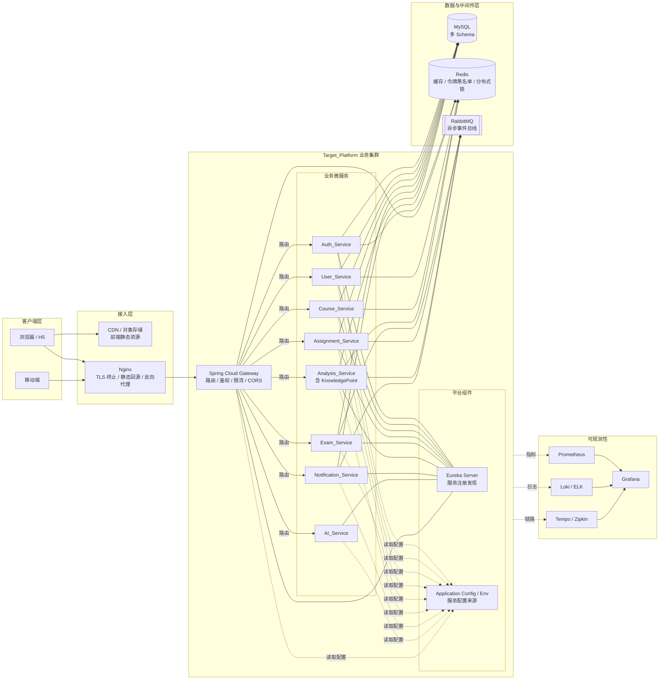
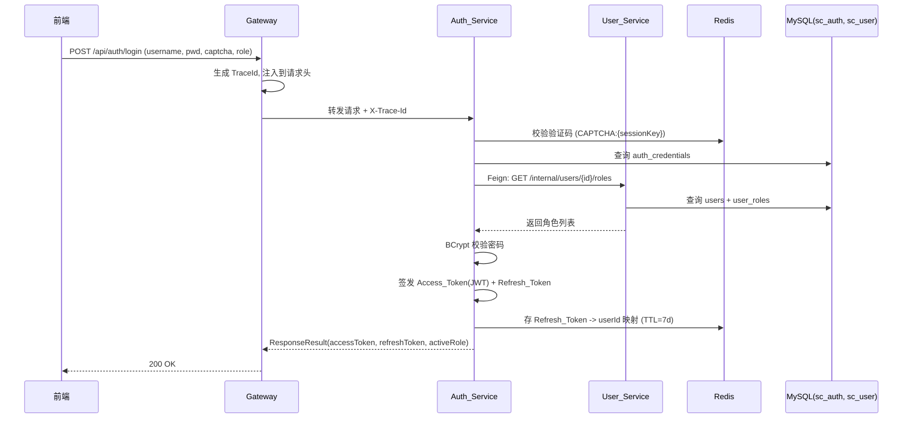
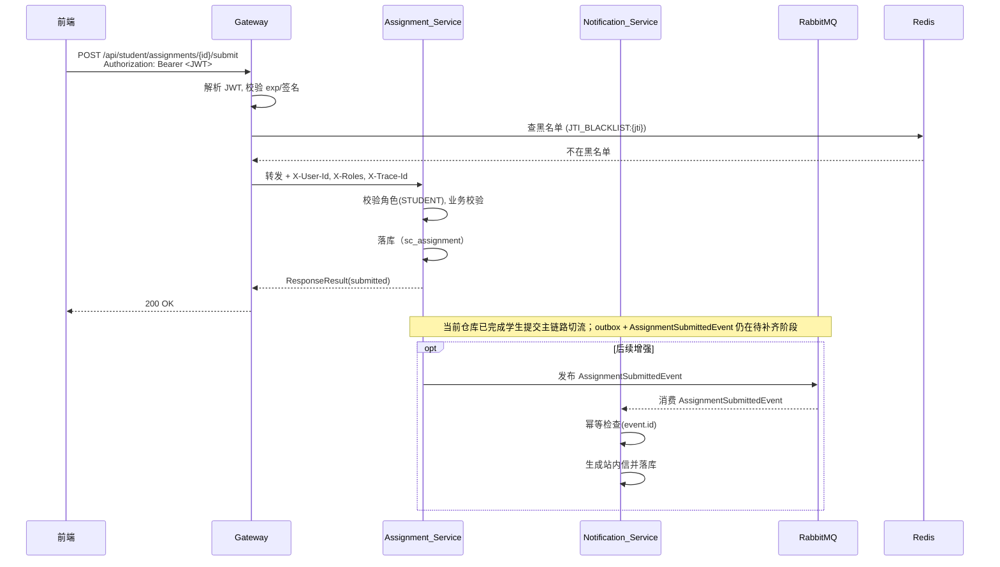
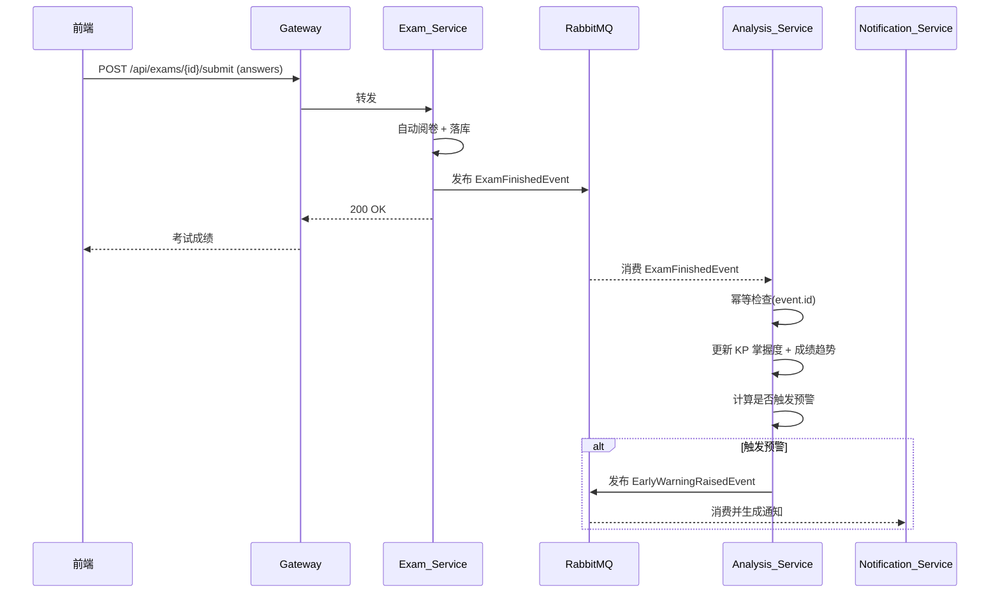
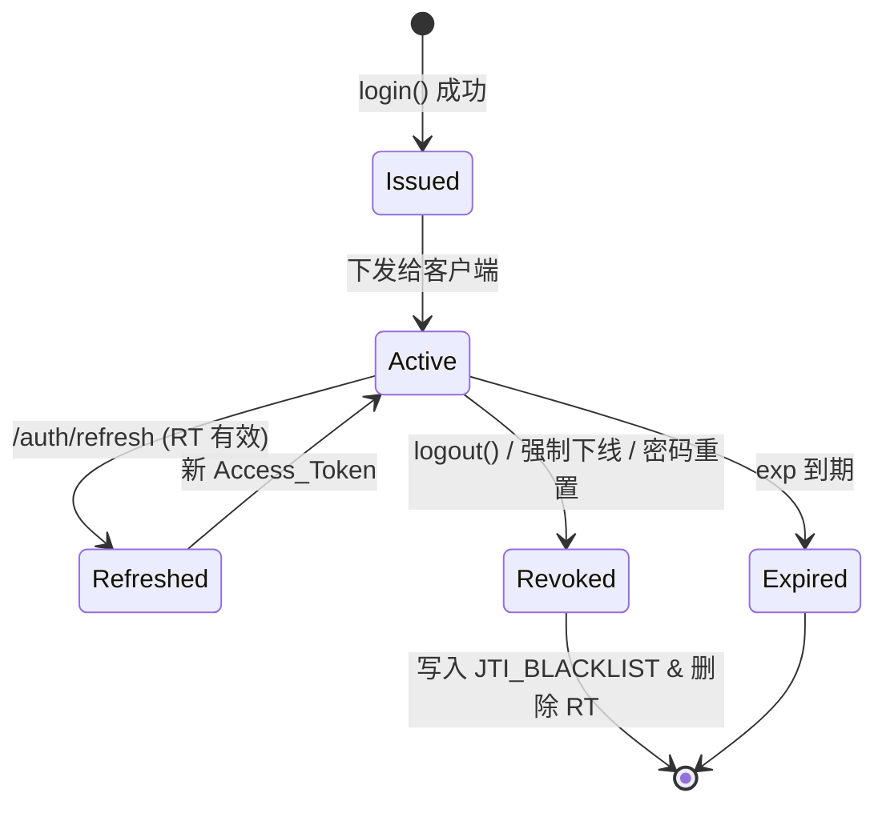
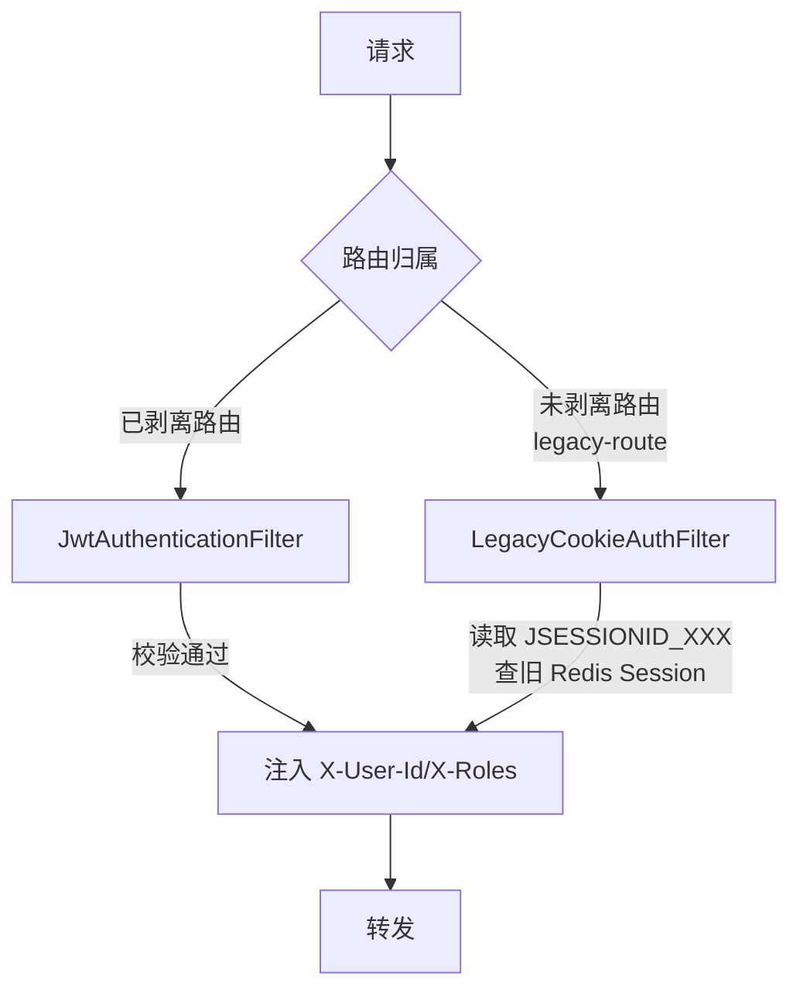
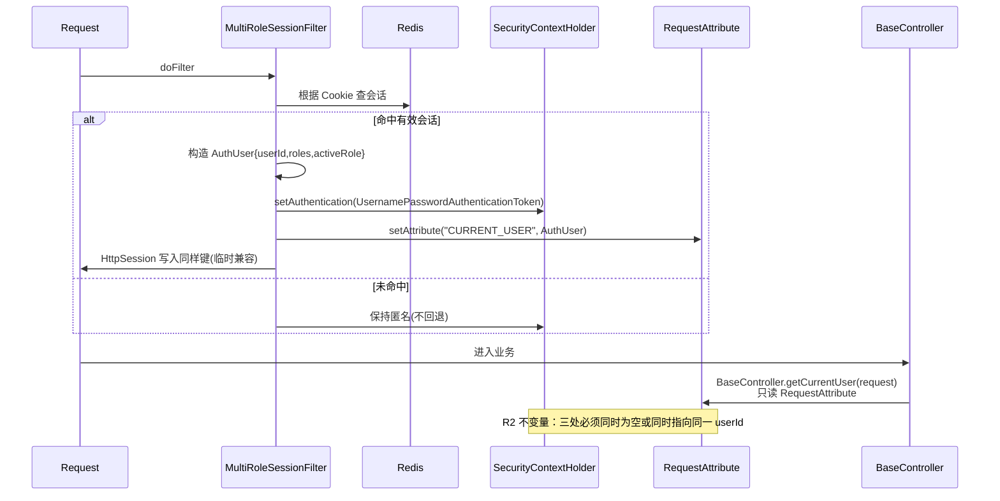
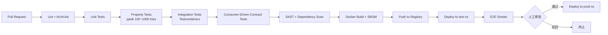
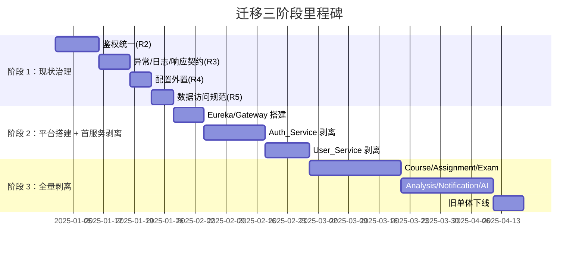
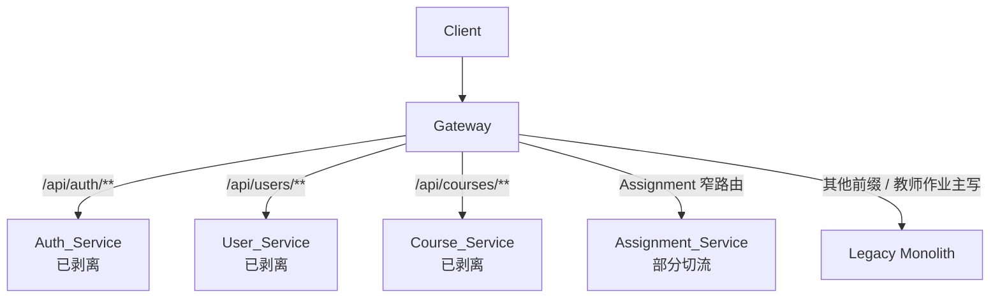

# 设计文档：Spring Cloud 微服务化改造与既有系统优化

> 版本：v0.3  
> 最后更新：2026-05-14  
> 作者：架构组  
> 对应需求：`.kiro/specs/spring-cloud-migration/requirements.md`（R1~R18）

## Overview（概述）

本文档基于已确认的 18 条需求（下文用 `R{n}` 缩写引用），给出从当前单体 `major_assignment` 演进到 Spring Cloud 微服务平台 `Target_Platform` 的完整设计。

设计覆盖两条主线：

1. **现状治理主线（对应 R1~R5、R14 部分）**：在不改变业务行为的前提下，先把单体内的鉴权、异常、日志、配置、数据访问与缓存规范好，为拆分做好"可抽离、可替换"的基础。
2. **架构升级主线（对应 R6~R17）**：在现状治理达标后，按领域边界进行微服务拆分，搭建网关、注册中心、服务治理、令牌鉴权、可观测性、容器化部署与迁移路径等平台能力；配置管理在当前阶段先由服务本地配置与环境变量承接。

所有章节在涉及决策处显式标注来源需求编号（例如 `[满足 R6、R10]`），以满足 R18 对"需求到设计可溯源"的要求。

本文档记录目标架构与过渡期设计决策，不逐项维护接口级实施状态、任务勾选进度或 Gateway 细粒度切流范围；这些执行细节统一以 `.kiro/specs/spring-cloud-migration/tasks.md` 为准。

**设计原则**：

- **演进优先，革命其次**（[满足 R16]）：先治理、再拆分、再下线单体；避免一次性重写。
- **边界清晰**（[满足 R6、R12]）：以领域为边界拆分服务，一张表只归属一个服务。
- **契约稳定**（[满足 R8、R10、R16]）：对外契约（REST JSON、Feign DTO）比内部实现更稳定，避免频繁破坏性变更。
- **可观测性内建**（[满足 R13]）：从第一行微服务代码起就默认接入 TraceId、结构化日志与指标。
- **安全默认开启**（[满足 R4、R9、R17]）：敏感配置外置、JWT 密钥可轮换、HTTPS 与 BCrypt 默认开启。

---

## Architecture（架构）

### 1. 目标平台整体架构图 [满足 R6、R7、R8、R13、R14、R15]



### 2. 微服务清单与职责边界 [满足 R6]

采用"8 个业务服务 + 2 个平台组件"拆分方案（KnowledgePoint 并入 Analysis_Service，原因：其核心价值是"掌握度分析"，数据强依赖 Assignment/Exam 成绩，与 Analysis 共享聚合口径）。

| # | 服务 | 核心职责 | 主要对外 API 前缀 | 不做什么（反职责） |
| - | ---- | -------- | ------------------ | ------------------ |
| 1 | **Auth_Service** | 登录、登出、令牌颁发/刷新/吊销、多角色切换、验证码校验 | `/api/auth/**` | 不存用户业务属性（只存认证凭据与凭据衍生物） |
| 2 | **User_Service** | 用户档案、角色分配、学生/教师画像 | `/api/users/**`、`/api/students/**`、`/api/teachers/**` | 不做鉴权、不颁发令牌 |
| 3 | **Course_Service** | 课程、班级、选课关系 | `/api/courses/**` | 不处理作业/考试细节 |
| 4 | **Assignment_Service** | 作业发布、提交、批改 | `/api/teacher/assignments/**`、`/api/teacher/submissions/**`、`/api/student/assignments/**` | 不做成绩聚合分析 |
| 5 | **Exam_Service** | 考试、试卷、试题、考试提交、自动阅卷 | `/api/exams/**` | 不做跨考试的学情分析 |
| 6 | **Analysis_Service** | 学情预警、知识点掌握度、成绩趋势、Dashboard 汇聚 | `/api/analysis/**`、`/api/knowledge-points/**`、`/api/early-warnings/**`、`/api/dashboard/**` | 不做在线业务写操作（只读 + 事件驱动） |
| 7 | **Notification_Service** | 站内信、系统通知、订阅/广播 | `/api/notifications/**` | 不承载业务事实数据 |
| 8 | **AI_Service** | 题目生成、试卷生成、学习建议、AI 模型代理 | `/api/ai/**` | 不写业务库（结果由业务服务落库） |
| P1 | **Gateway** | 路由、鉴权、限流、CORS、TraceId 注入 | 对外唯一入口 | 不承载业务逻辑 |
| P2 | **Eureka Server** | 服务注册发现 | — | — |
| P3 | **Application Config / Env** | 服务配置、密钥与路由规则来源 | — | 当前阶段不做独立配置中心，避免首轮拆分引入额外基础设施 |

### 3. 数据所有权矩阵 [满足 R6、R12]

每张业务表必须且仅有一个写权限所有者（属于 R12 的所有权唯一性不变量）。过渡期允许共享同一物理库、不同 Schema。

| 表名（原单体） | 归属服务 | Schema（目标） | 备注 |
| --- | --- | --- | --- |
| `users`, `user_roles` | User_Service | `sc_user` | Auth_Service 只能通过 Feign 读取 |
| `auth_credentials`（新）、`token_blacklist`（Redis） | Auth_Service | `sc_auth` | 从 `users` 剥离口令字段 |
| `courses`, `classes`, `course_enrollment`, `class_students` | Course_Service | `sc_course` | 过渡期为作业学生可见性提供班级关系来源 |
| `assignments`, `assignment_submissions`, `assignment_classes` | Assignment_Service | `sc_assignment` | 当前教师端主写切流仍受跨库可见性约束 |
| `exams`, `exam_questions`, `exam_submissions` | Exam_Service | `sc_exam` | |
| `knowledge_points`, `kp_mastery`, `score_trends`, `early_warnings` | Analysis_Service | `sc_analysis` | 数据来源于事件 + 定时拉取 |
| `notifications` | Notification_Service | `sc_notification` | |
| `ai_generations`, `ai_prompts`（新） | AI_Service | `sc_ai` | 历史调用记录 |

### 4. 典型请求调用链路时序图 [满足 R8、R9、R10、R13]

#### 4.1 登录链路



#### 4.2 受保护接口调用链路（学生提交作业）



#### 4.3 考试提交触发学情分析链路



---

## Components and Interfaces（组件与接口）

### 1. 组件选型决策表 [满足 R7]

> 选型原则：Spring 官方默认栈优先、国内生态成熟度次之、运维成本与学习曲线兜底。

| 能力点 | 候选 | **选定方案** | 选择理由 | 备选及何时切换 |
| --- | --- | --- | --- | --- |
| Registry | Eureka / Nacos / Consul | **Eureka Server** | 与当前 Spring Cloud 2023.x 栈直接兼容，先收敛注册发现主链路，降低阶段 2 首轮改造复杂度 | 若后续切向 Kubernetes 原生服务发现，可评估 Spring Cloud Kubernetes |
| Config Management | `application.yml` + Env / Spring Cloud Config / Nacos Config / Apollo | **`application.yml` + Env（阶段 2 过渡态）** | 当前先保证服务注册、网关、认证与用户服务剥离稳定，配置中心延后引入 | 若后续需要集中化动态配置，再补 Spring Cloud Config 或 Apollo |
| API 网关 | Zuul / Spring Cloud Gateway | **Spring Cloud Gateway** | 官方推荐，基于 Reactor 非阻塞，性能更优；R7.2 强制要求 | — |
| 同步 RPC | RestTemplate / WebClient / OpenFeign | **OpenFeign + Spring Cloud LoadBalancer** | 声明式接口，类型安全；与熔断器集成良好；R7.5 强制要求 | — |
| 熔断限流 | Hystrix（已 EOL） / Resilience4j / Sentinel | **Spring Cloud Circuit Breaker + Resilience4j** | Spring 官方推荐替代；与 Micrometer 天然集成；纯 Java 无额外中间件 | 若后续治理需求升级，可切换到 Sentinel 获得更细粒度规则 |
| 链路追踪 | Sleuth（已并入 Micrometer）/ SkyWalking / OpenTelemetry | **Micrometer Tracing + OpenTelemetry 导出至 Tempo/Zipkin** | Spring Boot 3.x 原生路径；云原生标准；可切换后端不改代码 | SkyWalking 作为备选（探针式接入，对代码侵入小） |
| 日志聚合 | ELK / Loki | **Loki + Promtail + Grafana** | 与 Prometheus/Grafana 同生态，运维一体化；存储成本低 | ELK 作为备选，适合需要复杂全文检索场景 |
| 指标 | Micrometer + Prometheus | **Micrometer + Prometheus + Grafana** | Spring Boot Actuator 原生集成，R13.3 覆盖面直接满足 | — |
| 消息中间件 | RabbitMQ / RocketMQ / Kafka | **RabbitMQ 3.x** | 学习系统流量不高，运维轻量；Spring Cloud Stream binder 成熟；通过 Stream 抽象将来可换 Kafka | Kafka 作为高吞吐备选；若需事务消息切 RocketMQ |
| 消息抽象 | 直连 MQ SDK / Spring Cloud Stream | **Spring Cloud Stream（RabbitMQ binder）** | R7.8 强制要求；应用层不依赖具体 MQ | — |
| 分布式一致性 | XA / TCC / Saga / 本地消息表 | **本地消息表 + 事件驱动为主，Saga 为辅** | R12.5 禁止 XA；学习系统无强实时一致性需求 | 需跨服务事务时采用 Saga（Seata AT 可选） |
| 多角色令牌 | 多 Cookie（现状）/ 多 Token / **单 Token + claims 当前角色 + 切换接口** | **单 Token + Claims 包含 activeRole + `POST /api/auth/switch-role`** | 简化客户端存储；避免同浏览器多角色 Token 冲突；切换角色时只颁发新 JWT、旧 JWT 加黑名单 | 如有合规要求强制角色隔离，可切到"每角色独立 Token" |

### 2. Spring Boot / Spring Cloud 版本锁定 [满足 R7.1、R7.9、R15]

| 维度 | 版本 |
| --- | --- |
| JDK | 17（LTS） |
| Spring Boot | 3.5.3（与现状单体 `pom.xml` 一致） |
| Spring Cloud | **2025.0.0**（由 `parent-pom` 统一 BOM 锁定，与 Spring Boot 3.5.3 对齐） |
| Spring Cloud Netflix | 4.1.x（Eureka Client / Server） |
| Micrometer | 1.13+ |
| Resilience4j | 2.x |
| Eureka Server | 4.1.x |
| Mybatis Spring Boot Starter | 3.0.4（沿用） |

版本一致性由 `parent-pom` 的 BOM 统一管控（R7 不变量）；任何子模块不得自定义覆盖。

### 3. Gateway 路由与鉴权过滤器设计 [满足 R8、R9]

#### 3.1 路由配置（过渡期采用“窄路由切流 + legacy-route 兜底”，当前由 Gateway 本地配置承载）

| 路由 ID | HTTP 方法 | 路径前缀 / 模式 | 目标服务 | 是否需要鉴权 | 限流策略 |
| --- | --- | --- | --- | --- | --- |
| `auth-route` | `POST` | `/api/auth/login`, `/api/auth/refresh`, `/api/auth/captcha` | `auth-service` | 否 | 登录 60 QPS（按 IP） |
| `auth-secured` | `POST`,`GET` | `/api/auth/logout`, `/api/auth/me`, `/api/auth/switch-role` | `auth-service` | 是 | 常规 |
| `user-route` | `ALL` | `/api/users/**` | `user-service` | 是 | 常规 |
| `course-route` | `ALL` | `/api/courses/**` | `course-service` | 是 | 常规 |
| `assignment-teacher-read-route` | `GET` | `/api/teacher/assignments`, `/api/teacher/assignments/**` | `assignment-service` | 是 | 常规 |
| `teacher-submission-route` | `GET`,`PUT` | `/api/teacher/submissions`, `/api/teacher/submissions/**` | `assignment-service` | 是 | 核心 |
| `student-assignment-read-route` | `GET` | `/api/student/assignments`, `/api/student/assignments/**`, `/api/student/assignment-submissions` | `assignment-service` | 是 | 常规 |
| `student-assignment-submit-route` | `POST` | `/api/student/assignments/*/submit` | `assignment-service` | 是 | 核心（提交接口更宽松） |
| `exam-route` | `ALL` | `/api/exams/**` | `exam-service` | 是 | 核心 |
| `analysis-route` | `ALL` | `/api/analysis/**`, `/api/knowledge-points/**`, `/api/early-warnings/**`, `/api/dashboard/**` | `analysis-service` | 是 | 常规 |
| `notification-route` | `ALL` | `/api/notifications/**` | `notification-service` | 是 | 常规 |
| `ai-route` | `ALL` | `/api/ai/**` | `ai-service` | 是 | 按用户 QPS 限制 |
| `legacy-route`（过渡期） | 未切流的其他方法 / 路径 | `/api/**` 兜底，含教师端作业主写链路 | `legacy-monolith` | 是（沿用旧会话） | 常规 |

- 当前教师端作业主写接口 `POST / PUT / DELETE /api/teacher/assignments/**` 故意保留在 `legacy-route`，避免 `major_assignment` 与 `sc_assignment` 间出现数据可见性分叉。
- 细粒度路由开关与已切流范围以 `.kiro/specs/spring-cloud-migration/tasks.md` 为准。

#### 3.2 过滤器链顺序

```
ForwardedHeaders → CorsFilter → TraceIdFilter → RateLimitFilter(key=ip+uid+routeId)
  → JwtAuthenticationFilter(跳过白名单路由) → HeaderEnrichFilter(注入 X-User-Id/X-Roles/X-Trace-Id)
  → RouteFilter → Downstream
```

- `JwtAuthenticationFilter`：用 Config_Center 下发的公钥验签，读取 `sub / roles / jti / exp`；查 `JTI_BLACKLIST:{jti}`；失败返回 `ResponseResult(401, ...)`（R9.5、R8.4、R9 黑名单不变量）。
- `HeaderEnrichFilter`：剥离客户端自带的 `X-User-Id` 等伪造头，仅信任网关本次写入值（R8 鉴权不变量）。
- `TraceIdFilter`：若请求带 `X-Trace-Id`（来自上游负载均衡）则透传，否则生成 `UUID.randomUUID()`（R13.2、R8 Round-Trip）。

### 4. 认证授权设计 [满足 R9、R17]

#### 4.1 JWT Claims 约定

```json
{
  "iss": "auth-service",
  "sub": "10001",              // userId
  "roles": ["STUDENT", "CLUB_ADMIN"],   // 全部拥有的角色
  "activeRole": "STUDENT",     // 当前会话切换到的角色
  "iat": 1704000000,
  "exp": 1704001800,
  "jti": "b9f...",             // 唯一 ID，用于吊销
  "tokenType": "access"
}
```

Refresh_Token 为不透明字符串（UUID），存 Redis `REFRESH:{rt}` → `{userId, roles, issuedAt}`，TTL 7 天。

#### 4.2 Token 生命周期



#### 4.3 多角色策略（单 Token + activeRole + 切换接口）

- `/api/auth/login` 请求体含 `preferredRole`；服务端校验用户确实具备该角色后，将其放入 `activeRole`。
- `/api/auth/switch-role` 请求体 `{targetRole}`，校验后**吊销当前 JWT（加黑名单）**并颁发新 JWT，`activeRole` 改为 `targetRole`。
- 下游服务依据 `X-Active-Role` 做细粒度授权，`X-Roles` 用于查询类判断（如 Dashboard 聚合）。

#### 4.4 密钥轮换

- 使用 RSA 非对称密钥对：Auth_Service 持有私钥签名，Gateway/下游持公钥验签。
- Config_Center 下发当前 `kid` 与 `kid->publicKey` 映射；支持双密钥并存 48 小时完成轮换（R9.5 热轮换）。
- JWT `header.kid` 指明使用哪把密钥；网关按 kid 查对应公钥。

### 5. 服务间通信设计（OpenFeign）[满足 R10]

#### 5.1 `{service}-api` 模块结构

```
user-service-api/
 └── src/main/java
      ├── feign/UserFeignClient.java    // @FeignClient(name="user-service")
      └── dto/UserProfileDTO.java       // DTO 与 Vo
```

每个业务服务仅依赖其他服务的 `-api` 模块，不依赖对方的实现模块（防止传递依赖）。

#### 5.2 全局配置（在 starter 中封装）

- **`FeignRequestInterceptor`**：从 MDC 读取 `X-Trace-Id / X-User-Id / X-Roles / X-Active-Role` 并写入请求头（R10.2 自动透传）。
- **`GlobalFeignErrorDecoder`**：
  - 4xx → `RemoteClientException(code, msg, bodyJson)` → `ResponseResult(code, ...)`（R10.3、R10 Metamorphic）
  - 5xx → `RemoteServerException(...)`，触发熔断统计
- **`Resilience4jCircuitBreakerFactory`**：默认 `failureRateThreshold=50`, `slowCallDurationThreshold=2s`, `minimumNumberOfCalls=10`，可由 Config_Center 覆盖（R10.4、R11.2）。
- **Fallback 约定**：每个 Feign Client 必须显式声明 `fallbackFactory`，返回 `ResponseResult(503/504, reason)`，禁止返回 `null`（R11.3、R11 Invariant）。

#### 5.3 内部接口 vs 外部接口

- **内部接口**：前缀 `/internal/**`，仅接受来自 Registry 内部的调用（通过 mTLS 或共享 Header Token 限制）（R17.5）。
- **外部接口**：前缀 `/api/**`，走网关鉴权。

### 6. 会话与 Legacy_Session 过渡方案（双轨机制）[满足 R9.6、R16.2]

过渡期（阶段 2）内 Gateway 同时支持两种鉴权路径：



约束（R9.6）：**同一用户同时刻只能存在一套凭证**。Auth_Service 在登录成功时将旧 Session 失效（删除 Redis `LEGACY_SESSION:{sid}`），反之单体登录成功时通知 Auth_Service 将对应 JWT 黑名单化。阶段 3 完成后 `LegacyCookieAuthFilter` 下线。

### 7. 现状治理层面的设计（单体阶段）[满足 R2、R3、R4、R5]

#### 7.1 鉴权统一路径与 SecurityContext 同步 [R2]



关键改造：
- `BaseController` 新增 `getCurrentUser(HttpServletRequest)` 单一入口，不再读 `HttpSession`；保留兼容方法标记为 `@Deprecated`。
- `MultiRoleSessionFilter` 幂等：在已设置 `SecurityContext` 时直接放行，避免重复查 Redis（R2 幂等性）。
- `AuthenticationAspect` 与 `LoggingAspect` 改为**只读 MDC**，不再自行查 Session（R3.4）。

#### 7.2 全局异常与响应契约设计 [R3]

**`ResponseResult<T>` 最终结构**（沿用现有字段）：

```java
public class ResponseResult<T> {
    private boolean success;   // R3 Invariant: success == (200 <= code < 300)
    private int code;          // HTTP 语义化
    private String message;    // 非空
    private T data;            // 可为空
    private String traceId;    // 新增：便于前端上报问题
    private long timestamp;
}
```

**异常—状态码映射表**：

| 异常 | HTTP | code | 备注 |
| --- | --- | --- | --- |
| `MethodArgumentNotValidException` / `BindException` / `ConstraintViolationException` | 400 | 400 | 校验错误拼接 field/message |
| `IllegalArgumentException` | 400 | 400 | |
| `UnauthorizedException` | 401 | 401 | 未登录 |
| `ForbiddenException` | 403 | 403 | 角色不匹配 |
| `ResourceNotFoundException` | 404 | 404 | |
| `BusinessException` | 400 | 自定义业务码（4xxxx） | 子码携带业务语义 |
| `RemoteClientException` | 下游原 code | 下游 code | 透传 |
| `RemoteServerException` | 502 | 502 | 下游 5xx |
| `CallNotPermittedException`（熔断打开） | 503 | 503 | Fallback |
| 未知 `Exception` | 500 | 500 | Profile=prod 时隐藏堆栈 (R3.3) |

**MDC 字段**：`traceId`, `userId`, `role`, `uri`, `method`。由 `TraceIdFilter`/`MultiRoleSessionFilter` 写入，Filter 结束时 `MDC.clear()`。

**日志 JSON 字段**（Logback `JsonEncoder`）：`timestamp`, `level`, `logger`, `thread`, `traceId`, `userId`, `role`, `message`, `stacktrace`（R3.5）。

#### 7.3 敏感配置外置方案（三层）[R4]

```
┌────────────────────────────────────────────────┐
│ Layer 3 (云原生)  Spring Cloud Config / Apollo │  ← 后续如需集中配置再引入
├────────────────────────────────────────────────┤
│ Layer 2 (服务级)  application-{env}.yml         │
├────────────────────────────────────────────────┤
│ Layer 1 (本地/CI) 环境变量 ${DB_PASSWORD} 等     │  ← 阶段 1 立即执行
└────────────────────────────────────────────────┘
```

- `application.properties` 改为 `spring.datasource.password=${DB_PASSWORD:dev_only_pwd}`，`dev_only_pwd` 仅当开发且 `spring.profiles.active=dev` 时允许回退；Profile 为 `prod` 时缺失即 Fail-Fast（R4.4）。
- 日志打码：新增 `MaskingConverter`，匹配常见密钥字段名（`password|apiKey|secret|token`）输出为 `***`。
- Git pre-commit hook 与 CI 扫描步骤（gitleaks / detect-secrets）拦截明文密钥（R4 安全不变量）。

#### 7.4 Mapper SQL 组织规范 [R5.1]

| 判定条件 | 使用方式 |
| --- | --- |
| 多表 JOIN / 动态 `<where>`/`<foreach>` / 超过 10 行 | **XML** |
| 简单 CRUD（单表 select/insert/update/delete） | **注解** |
| 涉及存储过程或 CASE/WITH 等复杂 SQL | **XML** |
| 同一 Mapper 中两类方法都存在 | 拆分到两个 Mapper 文件 |

单体阶段整改：将现有使用注解写复杂 JOIN 的 Mapper 迁到 XML（详见 `docs/coding-guidelines.md`）。

#### 7.5 CacheConstants 设计 [R5.2~5.4]

```java
public final class CacheConstants {
    // 格式：CACHE:{domain}:{resource}  TTL 显式
    public static final String USER_PROFILE = "USER:PROFILE";     // key='#userId' TTL=10m
    public static final String COURSE_LIST  = "COURSE:LIST";      // key='#teacherId' TTL=5m
    public static final String KP_MASTERY   = "ANALYSIS:KPM";     // TTL=30m
    public static final String CAPTCHA      = "CAPTCHA:IMG";      // 与业务会话前缀隔离
    public static final String LOCK_PREFIX  = "LOCK";             // LOCK:{domain}:{resourceId}
}
```

分布式锁封装（R5.4）：

```java
public interface DistributedLock {
    boolean tryLock(String domain, String resourceId, Duration ttl);
    void unlock(String domain, String resourceId);
    <T> T withLock(String domain, String resourceId, Duration ttl, Supplier<T> action);
}
// 实现：基于 SETNX + Lua 解锁脚本（防误删）
```

单页最大条数 100（R5.5）：`PageRequestDTO` 的 `pageSize` 加 `@Max(100)`，`BaseController` 提供 `clampPageSize` 兜底。

---

## Data Models（数据模型）

### 1. 数据库拆分策略 [满足 R12]

**阶段 2（过渡期）**：共享同一物理 MySQL 实例，每个服务独立 Schema。DBA 只给对应服务账号授予本 Schema 的读写权限，从访问控制层面杜绝跨库直连。

**阶段 3（目标态）**：视规模决定是否拆实例；默认继续一库多 Schema，按需对热点服务（Exam / Analysis）独立实例。

**跨服务访问铁律**：
- ❌ 禁止 JDBC/Mybatis 直连别人的 Schema
- ✅ 走 Feign 同步调用（读多写少场景）
- ✅ 走 Spring Cloud Stream 领域事件（写多、可异步）

### 2. 跨服务一致性方案 [满足 R10.5、R12.5]

采用"**本地消息表 + 事件驱动**"为主、**Saga** 为辅。

#### 2.1 本地消息表

```sql
CREATE TABLE outbox_event (
    id           BIGINT PRIMARY KEY AUTO_INCREMENT,
    aggregate    VARCHAR(64) NOT NULL,   -- 如 'assignment_submission'
    aggregate_id VARCHAR(64) NOT NULL,
    event_type   VARCHAR(64) NOT NULL,   -- 如 'AssignmentSubmittedEvent'
    payload      JSON NOT NULL,
    status       TINYINT NOT NULL,       -- 0=pending, 1=sent, 2=failed
    created_at   DATETIME NOT NULL,
    sent_at      DATETIME NULL,
    INDEX idx_status_created (status, created_at)
);
```

业务事务与 `outbox_event INSERT` 在**同一本地事务**提交；独立 relay job（每服务一个）轮询 `status=0` 的记录投递到 RabbitMQ，成功后 `status=1`。

#### 2.2 事件表与幂等

消费端表：

```sql
CREATE TABLE processed_event (
    event_id  VARCHAR(64) PRIMARY KEY,
    topic     VARCHAR(64) NOT NULL,
    processed_at DATETIME NOT NULL
);
```

消费处理前先 `INSERT ... ON DUPLICATE KEY UPDATE`；若已存在则直接 ACK 跳过（R10 幂等性不变量）。

#### 2.3 Saga（仅在必须跨服务写入时使用）

例：考试提交失败需回滚学情分析的预警写入 → 用 Saga 编排补偿事件 `EarlyWarningRollbackEvent`。默认不主动使用，优先事件最终一致。

### 3. 缓存设计 [满足 R5、R13]

#### 3.1 命名空间与 TTL 矩阵

| 缓存名 | Key 表达式 | TTL | 失效策略 | 所属服务 |
| --- | --- | --- | --- | --- |
| `USER:PROFILE` | `#userId` | 10 min | 更新用户信息时 `@CacheEvict` | User_Service |
| `USER:ROLES` | `#userId` | 10 min | 修改角色时失效 | User_Service |
| `COURSE:LIST` | `#teacherId` | 5 min | 课程 CRUD 时失效 | Course_Service |
| `COURSE:DETAIL` | `#courseId` | 5 min | 同上 | Course_Service |
| `KP:MASTERY` | `#studentId:#courseId` | 30 min | Exam/Assignment 事件触发失效 | Analysis_Service |
| `SCORE:TREND` | `#studentId` | 30 min | 同上 | Analysis_Service |
| `AUTH:JTI_BLACKLIST` | `#jti` | 余下有效期 | TTL 自然过期 | Auth_Service（Redis 直写） |
| `AUTH:REFRESH` | `#rt` | 7 天 | 登出/刷新时失效 | Auth_Service |
| `CAPTCHA:IMG` | `#sessionKey` | 2 min | 验证后失效；前缀与业务会话隔离 | Auth_Service |

#### 3.2 失效策略规则

- 写操作必须用 `@Caching` 显式枚举所有 `@CacheEvict`（R5.3）。
- "读—写—读"场景使用分布式锁 + 双删（删除→写 DB→删除）避免并发穿透（R5 Round-Trip）。
- 缓存穿透：对"已知不存在"的查询，写入短 TTL 空值标记（60s）。
- 缓存雪崩：TTL 加 10%±随机抖动。

#### 3.3 分布式锁使用约定

- Key 固定格式 `LOCK:{domain}:{resourceId}`（R5.4）。
- 锁 TTL 必须显式传入，默认 30s，业务需保证执行时间 < TTL 或主动续期。
- 统一用 `DistributedLock.withLock(...)`，禁止在业务代码里手写 SETNX。

---

## Correctness Properties（正确性属性）

> *A property is a characteristic or behavior that should hold true across all valid executions of a system — essentially, a formal statement about what the system should do. Properties serve as the bridge between human-readable specifications and machine-verifiable correctness guarantees.*
>
> **属性**是系统在所有合法执行路径下都必须成立的行为或特征，它是可执行规范：把需求文档中"SHALL"语句翻译成可被 PBT 框架自动验证的全称量化陈述。

本节列出的 32 条属性覆盖了 R1~R18 中所有被 prework 分析判定为 **Property** 的验收标准；EXAMPLE / INTEGRATION / SMOKE 类的验证点进入 §Testing Strategy 中的"示例用例矩阵"。每条属性都标注其校验的需求编号。

### Property 1：会话一致性不变量

*For all* 合法的单体请求 `r`（携带有效 Cookie 与 Redis 会话），在 `MultiRoleSessionFilter` 执行后，从 `SecurityContextHolder.getContext().getAuthentication()`、`request.getAttribute("CURRENT_USER")`、`HttpSession` 同一键读取到的 `userId` 必须同时为空或同时指向同一用户。

**Validates: R2.1, R2.2, R2 Invariant（会话一致性）**

### Property 2：会话 Filter 幂等

*For any* 合法请求 `r`，多次调用 `MultiRoleSessionFilter.doFilter(r)` 所得到的 `SecurityContext` 内容必须与单次调用一致，不得产生差异或副作用。

**Validates: R2.2, R2 Idempotence**

### Property 3：无效会话不回退

*For any* 无效会话输入（null / 畸形 JSON / 过期记录 / 错误类型），`MultiRoleSessionFilter` 执行后 `SecurityContextHolder` 中的 `Authentication` 必须为 `null` 或 `AnonymousAuthenticationToken`，不得包含已认证主体。

**Validates: R2.3**

### Property 4：响应契约一致性

*For all* 后端错误来源 `e`（业务异常、校验异常、熔断 Fallback、限流拒绝），生成的 HTTP 响应体必须满足：是合法的 `ResponseResult<?>` JSON；`success == (200 <= code < 300)`；`message` 非空；`code` 与 HTTP 状态码在映射表中对应；且当 Fallback 场景时 `code ∈ {429, 503, 504}`。

**Validates: R3.1, R3.2, R3 Invariant, R11.3, R11 Invariant, R17.3**

### Property 5：日志与 MDC 字段完整性

*For any* 处理业务请求产生的日志行，JSON 输出必须包含完整字段：`timestamp / level / logger / thread / traceId / userId / role / uri / status / elapsed_ms / message`；且同一请求在 `MultiRoleSessionFilter`、`LoggingAspect`、`GlobalExceptionHandler` 记录的 MDC 字段值必须相等。

**Validates: R3.4, R3.5, R3 Metamorphic, R13.2**

### Property 6：敏感字段打码不变量

*For any* 字符串 `s` 或对象 `o` 含有匹配敏感键模式（`password | pwd | apiKey | secret | token | credential`）的字段，经 `MaskingConverter` 处理后的日志输出必须不包含原值，且在对应位置出现 `***`。

**Validates: R4.2, R4 安全不变量**

### Property 7：缓存配置唯一性

*For any* 带 `@Cacheable` 的 Service 方法 `m`，其 `(cacheName, key 表达式)` 组合在整个应用中必须唯一且可在 `CacheConstants` 中查到显式声明的 TTL（禁止默认 TTL）。

**Validates: R5.2, R5 缓存 key 唯一性**

### Property 8：缓存读-写-读一致性

*For any* `@Cacheable` 查询方法 `f` 与其对应的写方法 `g`（带 `@CacheEvict` / `@Caching`），调用序列 `f(x) → g(x, v) → f(x)` 的最终返回值必须等于 `v` 所导致的新状态，不得返回缓存中的旧值。

**Validates: R5.3, R5 Round-Trip**

### Property 9：分布式锁 Key 格式

*For any* `(domain, resourceId)` 输入，`DistributedLock.tryLock(domain, resourceId, ttl)` 在 Redis 中生成的实际 Key 必须匹配正则 `^LOCK:[^:]+:.+$`，且以 `LOCK:{domain}:` 为前缀。

**Validates: R5.4**

### Property 10：分页上限 clamp

*For any* 整数 `pageSize` 输入（包含负数、零、超大值、`Integer.MAX_VALUE`），`clampPageSize(pageSize)` 的返回值必须落在 `[1, 100]` 区间内，且当原值 `∈ [1,100]` 时保持不变。

**Validates: R5.5**

### Property 11：服务名三元一致

*For any* 业务微服务 `s ∈ Target_Platform`，其 `application.yml` 中的 `spring.application.name`、Eureka 注册记录中的服务名、Gateway 路由配置中的 `uri: lb://<name>` 三者必须相等。

**Validates: R6.3**

### Property 12：数据表写权限唯一

*For any* 业务表 `T`，对整个 Target_Platform 源码中所有包含对 `T` 的 INSERT / UPDATE / DELETE 的模块进行聚合，结果必须且仅隶属于一个微服务。

**Validates: R6 Invariant, R12.2, R12 所有权唯一性**

### Property 13：依赖版本一致

*For any* 子模块 `m` 的 `pom.xml`，`spring-boot.version` 必须等于 `3.5.3`，`spring-cloud-dependencies.version` 必须等于 `docs/architecture.md` 中声明的 Spring Cloud 2025.0.0 版本，不得由子模块覆盖。

**Validates: R7.1, R7 依赖一致性**

### Property 14：网关与 Feign 链路透传

*For any* 携带合法 JWT `t` 的请求 `r`，Gateway 转发后下游服务收到的 `X-User-Id / X-Roles / X-Active-Role` 必须等于 `t` 解码后的 `sub / roles / activeRole`；同理，*for any* 已设置 MDC 上下文 `(traceId, userId, roles)` 的服务 A，OpenFeign 调用服务 B 时 B 收到的对应请求头必须等于 A 的 MDC 值。

**Validates: R8.3, R8 鉴权不变量, R10.2**

### Property 15：无效 JWT 返回 401 + ResponseResult

*For any* 无效 JWT（缺失 / 畸形 / 过期 / 签名错 / 黑名单中）对需要鉴权的下游接口的访问请求，Gateway 必须返回 HTTP 401 且响应体 JSON 可被 `ResponseResult` 反序列化，`success == false, code == 401`，下游服务不得收到该请求。

**Validates: R8.4, R9.4（黑名单）**

### Property 16：TraceId 全链路一致

*For any* 经过 Gateway 的请求 `r`，Gateway 写入的 `X-Trace-Id` 必须与下游服务（含跨 Feign 链路）日志中记录的 `traceId` 完全一致；对任意 TraceId `t`，收集到的所有 Span 必须能在链路追踪系统中形成一棵连通树（有且仅有一个根 Span，无孤立 Span）。

**Validates: R8.5, R8 Round-Trip, R13.2, R13 链路完整性**

### Property 17：网关限流按键分桶

*For any* 请求序列 `(ip, userId, routeId, ...)`，Gateway 的限流计数器必须按 `(ip, userId, routeId)` 三元组作为分桶键；超过该桶阈值的请求返回 HTTP 429，未超过的请求不受其他桶影响；登录接口对同一 IP 60 秒内失败超过 30 次必须触发限流或临时封禁。

**Validates: R8.7, R17.4**

### Property 18：CORS 白名单行为与配置一致

*For all* 配置在 Gateway `application.yml` 或环境变量中的 `cors.allowedOrigins` 列表 `L` 与任意请求 `Origin` 头 `o`，Gateway 的 CORS 判定结果必须满足：当 `o ∈ L` 时返回正常响应并附带 `Access-Control-Allow-Origin: o`；当 `o ∉ L` 时拒绝预检或不回写允许头；且修改 `L` 后重启或重新加载配置后生效。

**Validates: R8.6, R14.3**

### Property 19：JWT 签发-解码 Round-Trip

*For any* 合法 Claims 结构 `c = {sub, roles, activeRole, iat, exp, jti, tokenType}`，`verify(sign(c)) == true` 且 `decode(sign(c)).claims ≡ c`（语义等价）；签发得到的 JWT 必须至少包含 `sub / roles / iat / exp / jti` 全部字段且值正确。

**Validates: R9.3, R9 Round-Trip（令牌编解码）**

### Property 20：Token 黑名单生命周期

*For any* 被写入 `JTI_BLACKLIST` 的 `jti`，在其原始 `exp` 之前的所有验签调用必须判定该 Token 为无效；黑名单 Redis 记录的 TTL 必须 ≤ Token 剩余有效期；黑名单过期后该 `jti` 不会被复用（因为新 Token 使用新 `jti`）。

**Validates: R9.4, R9 黑名单不变量**

### Property 21：登出幂等

*For any* Refresh_Token `rt`，连续调用 `POST /api/auth/logout` N 次（N ≥ 1），每次都必须返回 `success=true` 的响应，且 Redis `JTI_BLACKLIST` 中对应 `jti` 仅被写入一次（第二次起为幂等 no-op），不得抛出异常。

**Validates: R9 Idempotence**

### Property 22：密钥热轮换双密钥并存

*For any* 在密钥轮换窗口期（默认 48 小时）内用旧私钥 `K1` 或新私钥 `K2` 签发的 JWT `t`，Gateway 依据 `header.kid` 查找对应公钥后必须可以成功验签；轮换窗口期结束后用 `K1` 签发的 Token 不得通过验签。

**Validates: R9.5**

### Property 23：多角色切换一致性

*For any* 用户 `u` 持有角色集合 `R` 与当前 JWT `t_old`（`activeRole ∈ R`），调用 `switch-role(target)` 当且仅当 `target ∈ R` 时成功；成功时：新 Token `t_new` 的 `activeRole == target`、`sub == u.id`、`roles == R`；旧 `jti(t_old)` 必须被写入黑名单。

**Validates: R9.7**

### Property 24：单体 / JWT 凭证互斥

*For any* 用户 `u` 在过渡期的登录操作序列 `ops`（交错的单体登录、JWT 登录、登出），在任意中间状态下查询 `u` 的活跃凭证集合时，要么全部来自 Legacy_Session、要么全部来自 JWT，不得同时存在两套有效凭证。

**Validates: R9.6**

### Property 25：ErrorDecoder 错误分类

*For any* Feign 调用返回的 HTTP 状态码 `s ∈ [400, 599]`，`GlobalFeignErrorDecoder` 产生的异常满足：`s ∈ [400, 499]` 时抛出 `RemoteClientException`（或其子类），`s ∈ [500, 599]` 时抛出 `RemoteServerException`；两类异常不得混淆；异常中携带的 `code` 等于原始 HTTP 状态码。

**Validates: R10.3, R10 Metamorphic**

### Property 26：事件消费幂等

*For any* 领域事件 `e` 被消费端接收一次或多次（N ≥ 1），其业务副作用（数据库状态、衍生事件、通知记录）必须与消费一次时完全相等；`processed_event` 表对同一 `event.id` 最多只会记录一次。

**Validates: R10.5, R10 Idempotence**

### Property 27：熔断器状态转移

*For any* Feign Client `fc` 的失败率时间序列，当滑动窗口内 `failureRate ≥ failureRateThreshold` 且样本数 `≥ minimumNumberOfCalls` 时，熔断器必须从 CLOSED 转为 OPEN；在 OPEN 状态持续 `waitDurationInOpenState` 后转为 HALF_OPEN；HALF_OPEN 的探测请求成功率达标后回到 CLOSED，否则回到 OPEN；在 OPEN 状态任何调用立即返回 Fallback 而非真实调用下游。

**Validates: R10.4, R11.2**

### Property 28：部署产物无前端资源

*For any* 业务微服务的构建产物 JAR `j`，解压后必须不含扩展名为 `.html / .js / .css / .vue / .tsx` 的文件（`static/` 目录或其他位置均不允许）；前端资源仅存在于独立前端项目的构建产物中。

**Validates: R14 部署解耦**

### Property 29：环境 Profile ↔ 配置源映射

*For any* 部署环境 `env ∈ {dev, test, prod}`，启动命令传入的 `spring.profiles.active=env` 时服务必须只读取对应的 `application-{env}.yml` 与环境变量组合，不得跨环境读取；且 Spring Profile 与配置源组合一一对应。

**Validates: R15.5**

### Property 30：阶段 2 接口兼容性

*For any* 已声明"阶段 2 未剥离"的接口 `I`，在过渡期内：(a) 经 Gateway 的请求必须被路由到旧单体；(b) 请求经 Gateway 后的响应（状态码、JSON 结构、字段值、字段类型）必须与直接访问旧单体的响应语义等价；(c) 对被切换为新服务的接口，前端 URL 保持不变、请求契约向后兼容；(d) 版本化接口 `v1 / v2` 必须在至少一个发布周期内并存。

**Validates: R16.2, R16.5, R16 接口兼容性**

### Property 31：密码 BCrypt 与敏感字段脱敏

*For any* 新建或修改密码的用户流程，数据库 `password` 字段必须匹配 BCrypt 正则 `^\$2[aby]\$\d{2}\$[./A-Za-z0-9]{53}$`；*for any* 手机号 / 邮箱展示函数的输入，输出必须按规则脱敏（手机号保留前 3 后 4；邮箱保留用户名首字符与完整域名）。

**Validates: R17 加密不变量, R17.6**

### Property 32：文档需求可溯源

*For every* 需求编号 `R{n}`（`n ∈ 1..18`）以及每条 Acceptance Criteria `R{n}.{m}`，`design.md` 与 `docs/migration-plan.md` 中必须至少存在一处显式引用；扫描两份文档的字面出现次数应 ≥ 1。

**Validates: R18 文档可溯源**

---

## Error Handling（错误处理）

### 1. 单体阶段（R3）

- **异常分类**：
  - `BusinessException` / `UnauthorizedException` / `ForbiddenException` / `ResourceNotFoundException`：业务语义异常，由业务代码显式抛出。
  - 参数校验异常：由 Spring 自动抛出，`GlobalExceptionHandler` 识别后聚合字段级错误信息。
  - 未知 `Exception`：兜底逻辑，`prod` Profile 隐藏堆栈。
- **处理路径**：`@ControllerAdvice` 的 `GlobalExceptionHandler` 是**唯一**异常出口，禁止 Controller/Service 层自行返回 `ResponseResult.error(...)` 后继续吞掉异常（否则 MDC 上下文会丢失）。
- **MDC 管理**：`MultiRoleSessionFilter` / `TraceIdFilter` 是 MDC 的**唯一写入者**；所有其他组件只读。Filter 结束前在 `finally` 块执行 `MDC.clear()`，避免线程复用污染。

### 2. 微服务阶段（R8、R10、R11）

- **分层错误流转**：

```
  下游服务错误 (5xx)
        ↓ response 200/4xx/5xx
  Feign Client  ← GlobalFeignErrorDecoder → RemoteClientException / RemoteServerException
        ↓
  业务 Service ← CircuitBreaker 统计失败率
        ↓ 熔断打开 → 调用 FallbackFactory
  Fallback 方法返回 ResponseResult(503/504/429, reason)
        ↓
  Controller → @ControllerAdvice 不再转换（已是 ResponseResult）
        ↓
  Gateway 按原样透传给前端
```

- **降级响应规范**（R11.3）：
  - Fallback 方法必须**显式**定义，不允许 `default T fallback() { return null; }`。
  - 返回 `ResponseResult(503, "{服务名} 暂时不可用，请稍后重试", traceId)`。
  - 所有 Fallback 内禁止再次调用网络资源（避免二次故障）。
- **网关级兜底**：Gateway 对 `ReactiveCircuitBreaker` 捕获到的 `CallNotPermittedException` 统一返回 `ResponseResult(503)`；对路由目标完全不可达（Registry 查不到实例）返回 `ResponseResult(504)`。
- **前端契约稳定性**（R17.3）：Gateway 保证任何情况下响应体都是合法 `ResponseResult` JSON，不允许空体或 HTML 错误页。

### 3. 异常 → HTTP 状态码映射表（完整）

| 异常类型 | HTTP | code | 响应体中其他字段 |
| --- | --- | --- | --- |
| `MethodArgumentNotValidException` | 400 | 400 | `data.fields[]` 列举字段级错误 |
| `ConstraintViolationException` | 400 | 400 | 同上 |
| `BindException` | 400 | 400 | 同上 |
| `IllegalArgumentException` | 400 | 400 | — |
| `HttpMessageNotReadableException` | 400 | 400 | 固定文案 "请求体格式错误" |
| `UnauthorizedException` | 401 | 401 | — |
| `ForbiddenException` | 403 | 403 | — |
| `ResourceNotFoundException` | 404 | 404 | — |
| `HttpRequestMethodNotSupportedException` | 405 | 405 | — |
| `BusinessException` | 400 | 4XXXX（业务子码） | `data.bizCode` |
| `RemoteClientException` | 透传 | 透传 | 封装下游 message |
| `RemoteServerException` | 502 | 502 | — |
| `CallNotPermittedException` | 503 | 503 | `data.circuit = "OPEN"` |
| `TimeoutException` | 504 | 504 | — |
| `RateLimitExceededException` | 429 | 429 | `data.retryAfter` |
| 其他 `Exception` | 500 | 500 | prod 隐藏 stacktrace |

---

## Testing Strategy（测试策略）

### 1. 总体分层

| 层级 | 目标 | 主要手段 |
| --- | --- | --- |
| 静态与契约 | 结构/命名/依赖合规 | ArchUnit、gitleaks、OpenAPI 契约测试 |
| 单元测试 | 纯逻辑、边界条件 | JUnit 5 + Mockito |
| **属性测试（PBT）** | 正确性属性（§32 条） | **jqwik 1.9.x**（Java 原生、JUnit 5 友好） |
| 集成测试 | 服务内路径联通、中间件契约 | Spring Boot Test + Testcontainers（MySQL / Redis / RabbitMQ / Eureka） |
| 契约测试 | 服务间 API 兼容 | Spring Cloud Contract |
| 端到端 | 跨服务全链路 | REST Assured + docker-compose 栈 |
| 性能 | 压测指标（R17.1） | k6 或 JMeter |
| 冒烟 | 部署健康检查 | `/actuator/health` + 基础场景 |

### 2. 属性测试（PBT）约束 [满足 R18]

- **框架选型**：Java 选用 [jqwik](https://jqwik.net)，Spring Boot 3.x / JUnit 5 原生支持；Kotlin 可选 Kotest property。
- **不自行实现 PBT 引擎**（框架层要求）。
- **每条属性 ≥ 100 次迭代**；对关键属性（P19 JWT Round-Trip、P8 Cache Round-Trip、P26 Event Idempotence）要求 ≥ 1000 次。
- **标签格式**：每个属性测试必须添加 JUnit 标签与注释：
  ```java
  @Property(tries = 100)
  @Tag("pbt")
  // Feature: spring-cloud-migration, Property 19: JWT 签发-解码 Round-Trip
  void jwtSignDecodeRoundTrip(@ForAll @From("validClaims") JwtClaims c) { ... }
  ```

### 3. 关键生成器（Arbitraries）设计

| 生成器 | 产出 | 覆盖属性 |
| --- | --- | --- |
| `validClaims()` / `invalidClaims()` | 合法 / 非法 JWT Claims 对象（角色组合、过期时间边界、多 activeRole） | P19, P20, P22, P23 |
| `authUserArb()` | 随机 userId(Long) + roles(∈ {STUDENT, TEACHER, ADMIN, CLUB_ADMIN} 幂集) + activeRole | P1, P2, P23 |
| `invalidSessionArb()` | null / 空串 / 畸形 JSON / 过期时间戳 / 伪造字段类型 | P3 |
| `responseErrorSourceArb()` | BusinessException / 校验异常 / RemoteClientException / CallNotPermittedException / Timeout | P4 |
| `logEntryArb()` | 随机日志消息 + 随机 MDC 上下文 | P5 |
| `maskingInputArb()` | 含敏感键名的随机 JSON / toString 文本 | P6 |
| `cacheOpSequenceArb()` | 读写读序列（含乱序、并发） | P8 |
| `lockKeyArb()` | `(domain, resourceId)` 组合（含特殊字符、空串、超长） | P9 |
| `pageSizeArb()` | `[Integer.MIN_VALUE, Integer.MAX_VALUE]` | P10 |
| `httpStatusArb()` | `[400, 599]` 任意整数 | P25 |
| `failureRateSeriesArb()` | 0.0-1.0 的失败率时间序列（长度 10-200） | P27 |
| `traceIdArb()` | UUID / 长度 1-128 的合法字符 | P16 |
| `originArb()` | 常见 URL 模式（含 http/https、端口、子域） | P18 |
| `domainEventArb()` | 随机 `AssignmentSubmittedEvent / ExamFinishedEvent / EarlyWarningRaisedEvent` | P26 |
| `concurrentLoginOpsArb()` | 单体登录 + JWT 登录 + 登出的交错序列 | P21, P24 |

### 4. 示例用例矩阵（EXAMPLE / INTEGRATION / SMOKE）

**EXAMPLE（明确断言，不需 PBT）**

| 验证点 | 手段 |
| --- | --- |
| R1.1~R1.3（诊断报告结构与关键词） | Markdown 解析 + 关键字断言 |
| R2.1、R3.1（Controller 结构） | ArchUnit |
| R2.4（CSRF 配置） | `SpringBootTest` 扫描 Security 配置 |
| R2.5（验证码前缀隔离） | 常量断言 |
| R3.3（prod 隐藏 stacktrace） | `@ActiveProfile("prod")` 单测 |
| R4.4（prod 缺失密钥 Fail-Fast） | 缺参启动 ApplicationContext 断言失败 |
| R6.2（每服务独立结构） | 目录结构校验 |
| R6.4（单体移除迁出类） | ArchUnit |
| R6.6（Analysis 入口为事件/定时） | ArchUnit + Controller 扫描 |
| R7.2~R7.8（选型依赖） | `mvn dependency:tree` 断言 |
| R9.1、R9.2（接口存在 + 有效期可配） | MockMvc |
| R11.5（核心/非核心阈值差异） | 配置断言 |
| R12.1（Schema 独立） | datasource 断言 |
| R13.1、R13.3（Actuator/Prometheus 指标存在） | HTTP 探测 |
| R14.2（Gateway 路由） | 路由配置断言 |
| R15.1（Dockerfile 内容） | 文件正则扫描 |
| R16.1、R16.4（迁移计划结构） | Markdown 解析 |
| R18.2~R18.5（文档结构） | Markdown 解析 + Mermaid 标签扫描 |

**INTEGRATION（Testcontainers / 真实中间件）**

| 验证点 | 手段 |
| --- | --- |
| R4.5（配置源拉取） | 不同 Profile 启动服务并断言配置加载 |
| R11.2（限流/熔断阈值切换） | 覆盖不同配置组合并断言熔断器行为变化 |
| R11.4（错误率告警） | 触发错误 + 查询 AlertManager 模拟器 |
| R13.4~R13.6（日志聚合、TraceId 检索） | Loki + Tempo 容器 |
| R15 可重复构建 | CI 双次构建镜像比对层校验和 |
| R17.1（P95 ≤ 800ms） | k6 压测脚本 + 阈值断言 |
| R17.2（可用性） | 监控系统长期统计（非 CI） |

**SMOKE（部署/文件存在/演练）**

| 验证点 | 手段 |
| --- | --- |
| R1.4、R1.5、R4.1、R4.3 | 文件存在 + grep |
| R6.1（服务清单完整） | Maven 模块枚举 |
| R6.5、R7.9（架构决策） | 评审记录 |
| R8.1（Gateway 注册） | 启动后查询 Eureka 注册表 |
| R14.1（静态资源迁出） | CI jar 扫描（同 P28） |
| R15.2、R15.3（交付物存在 + CI 阶段） | 文件存在 + YAML 断言 |
| R16.3（30 分钟回滚） | 演练报告 |
| R17.5（HTTPS / mTLS） | `openssl s_client` 探测 |
| R18.1（8 篇文档存在） | CI |

### 5. CI 集成

- **流水线阶段**（R15.3）：`lint → unit → pbt → integration → contract → docker-build → docker-push → deploy-test → e2e-smoke`
- **PBT 运行时间约束**：专设 `pbt` profile，核心属性 1000 次、其他 100 次，整体预算 ≤ 5 分钟/服务；超时自动降级到 100 次但标记告警。
- **失败策略**（R15.4）：任一阶段失败立即终止，失败制品（jqwik 的 shrinking counterexample、测试报告、Docker 层清单）归档至流水线工件。

---

## Deployment & DevOps（部署与 DevOps）[满足 R15]

### 1. Dockerfile 模板（多阶段构建）

```dockerfile
# ---- Stage 1: build ----
FROM maven:3.9-eclipse-temurin-17 AS builder
WORKDIR /build
COPY pom.xml ./
COPY src ./src
RUN mvn -B -q -DskipTests package

# ---- Stage 2: runtime ----
FROM eclipse-temurin:17-jre-jammy
WORKDIR /app
COPY --from=builder /build/target/*.jar app.jar
EXPOSE 8080
ENV JAVA_OPTS="-XX:MaxRAMPercentage=75.0 -XX:+UseG1GC"
ENTRYPOINT ["sh", "-c", "exec java $JAVA_OPTS -jar app.jar"]
HEALTHCHECK --interval=30s --timeout=3s CMD curl -f http://localhost:8080/actuator/health || exit 1
```

- 基础镜像固定 `eclipse-temurin:17-jre-jammy`（满足 R15.1：OpenJDK 17 精简）。
- 不使用 `--no-install-recommends` 之外的包安装，降低镜像体积。

### 2. 本地开发：docker-compose

```yaml
version: "3.9"
services:
  registry-server:
    build: ./registry-server
    ports: ["8761:8761"]
  mysql:
    image: mysql:8.0
    environment: { MYSQL_ROOT_PASSWORD: devroot }
    ports: ["3306:3306"]
  redis:
    image: redis:7-alpine
    ports: ["6379:6379"]
  rabbitmq:
    image: rabbitmq:3-management
    ports: ["5672:5672", "15672:15672"]
  prometheus: { image: prom/prometheus, ports: ["9090:9090"] }
  grafana:    { image: grafana/grafana, ports: ["3000:3000"] }
  gateway:    { build: ./gateway, depends_on: [registry-server], ports: ["8080:8080"] }
  auth:       { build: ./auth-service, depends_on: [registry-server, mysql, redis] }
  user:       { build: ./user-service, depends_on: [registry-server, mysql] }
  # ...其余服务
```

### 3. 测试 / 生产：Kubernetes Helm Chart 结构

```
deploy/
├── charts/
│   ├── platform-infra/        # Eureka / Prometheus / Loki / Tempo / RabbitMQ
│   └── {service}/             # 每服务一个 Chart
│       ├── Chart.yaml
│       ├── values.yaml        # 默认值
│       ├── values-dev.yaml
│       ├── values-test.yaml
│       ├── values-prod.yaml
│       └── templates/
│           ├── deployment.yaml
│           ├── service.yaml
│           ├── configmap.yaml
│           ├── hpa.yaml
│           └── servicemonitor.yaml
└── umbrella-chart/            # 组合所有服务，一条命令部署完整平台
```

环境 ↔ 命名空间一一对应（满足 P29）：`helm install -n dev -f values-dev.yaml` / `-n test` / `-n prod`。

### 4. CI/CD 流水线阶段设计



- 任一阶段失败立即 `exit 1`，不允许跳过（R15.4）。
- 镜像打标：`{service}-{gitShortSha}-{date}`；同时打 `latest`（仅 test 环境）。

---

## Migration Path（迁移路径设计）[满足 R16]

### 1. 三阶段里程碑



### 2. 阶段 1「现状治理」（对应 R1~R5、R14 静态资源规划）

| 维度 | 进入条件 | 交付物 | 退出条件 | 回滚策略 |
| --- | --- | --- | --- | --- |
| 启动 | 需求文档 R1~R18 已确认 | `docs/diagnosis-report.md` v1 | 所有"高影响"问题已修复并验收 | 代码仓 Tag `v0-legacy` 可回滚 |
| 关键任务 | — | 鉴权统一 / 异常统一 / 配置外置 / 数据访问规范 | — | — |
| 验收用例 | — | PBT：P1~P10；EXAMPLE：R2.4、R3.3、R4.4 | 所有新增测试 ≥ 95% 通过 | — |

### 3. 阶段 2「平台搭建 + 首服务剥离」（对应 R6~R9、R13）

- **平台搭建**：Eureka（Registry）、Gateway、Prometheus/Grafana/Loki/Tempo 栈。
- **首剥离服务**：Auth_Service（依赖关系最薄，风险可控） → User_Service；当前 `Course_Service` 已具备独立承载能力，`Assignment_Service` 已进入窄路由切流 + 联调阶段。
- **网关双路由机制**（R16.2）：



  - Gateway 路由表当前由本地配置承载；切换路由通过发布配置变更完成。
  - Assignment 当前采用“按接口、按方法逐步切流”，而不是一次性启用单一 `assignment-route`。
  - `LegacyCookieAuthFilter` 在 `legacy-route` 生效；`JwtAuthenticationFilter` 在已剥离路由生效。
  - 双套凭证互斥由 Property 24 持续校验。
  - Assignment 的接口级进度、已切流范围与残留边界以 `.kiro/specs/spring-cloud-migration/tasks.md` 为准。

| 维度 | 内容 |
| --- | --- |
| 进入条件 | 阶段 1 全部验收通过 + Eureka/Gateway 预生产验证 |
| 退出条件 | Auth/User/Course 核心链路稳定；Assignment 窄路由联调通过并完成教师主写切流条件评估；P14~P24 全部通过；P30 在阶段 2 期间持续绿 |
| 回滚策略 | 将 Gateway 中对应路由 `uri` 由 `lb://auth-service` 改回 `http://legacy-monolith`（5 分钟内）；所有新 JWT 吊销；恢复单体登录接口；RTO ≤ 30 分钟（R16.3） |

### 4. 阶段 3「全量剥离与旧单体下线」（对应 R10~R17）

- 按依赖关系顺序：Course → Assignment → Exam → Analysis → Notification → AI。
- 每个服务剥离过程复用阶段 2 的双路由模板。
- Analysis_Service 的学情分析、早期预警由历史同步 + ExamFinished/AssignmentSubmitted 事件驱动双补齐。
- 当前阶段 3 的首个进入点，是 `Assignment_Service` 在运行时联调完成后补齐 outbox 事件，并评估教师端作业主写链路的最终切换。

| 维度 | 内容 |
| --- | --- |
| 进入条件 | 阶段 2 验收通过 + Assignment 运行时联调完成 + 事件驱动架构（RabbitMQ + outbox）双端联调通过 |
| 退出条件 | 所有业务流量经微服务；旧单体 `major_assignment` 下线；`legacy-route` 从 Gateway 配置删除；Property 28（jar 无前端资源）在所有服务上绿 |
| 回滚策略 | 每个子服务剥离独立回滚点；若多个服务同时回滚，走"版本化快照 + Gateway 路由配置回滚"（RTO 30 分钟） |

### 5. 接口契约与版本策略（R16.5）

- 当接口响应 / 请求契约发生向后不兼容变更：新增 `v2` 前缀（`/api/v2/...`）或 Header `X-Api-Version: 2`。
- v1 与 v2 至少并存一个发布周期（≥ 14 天）；过渡期由 Property 30 持续断言。
- Feign DTO 变更：`-api` 模块维持 v1 接口不变、新增 v2 接口；服务端双分支实现；删除 v1 必须跨两个主版本。

---

## Risks & Trade-offs（风险与权衡）

### 1. 微服务化本身的复杂度成本

| 维度 | 风险 | 缓解 |
| --- | --- | --- |
| 开发成本 | 模块数 ×10、接口契约维护负担 | 强制 `{service}-api` 模块 + Contract Tests；规范模板化 |
| 运维成本 | 容器 / Eureka / 监控栈新增运维面 | 采用 Helm 模板 + 伞 Chart 一键部署；初期保留少实例（每服务 1 Pod） |
| 调用延迟 | 跨服务 RPC 引入额外延迟 | 关键路径合并服务（R6.5 强一致聚合归并）；缓存 + Fallback 兜底 |
| 事务一致性 | 不再有跨表本地事务 | 本地消息表 + 事件驱动（§Data Models §2）；设计上避免强跨服务事务 |
| 学习曲线 | 团队需掌握 Spring Cloud / Eureka / MQ | 文档 `docs/*.md` 8 篇覆盖；阶段 2 开始前组织培训 |

### 2. 单体 / 微服务并存期的兼容性风险

- **凭证双轨**：Legacy_Session 与 JWT 同时存活可能出现状态不一致；由 Property 24 持续守护，上线前演练登录-登出-切换角色全链路。
- **数据双写**：过渡期同一数据库同时被单体与新服务读写（虽然通过不同 Schema，但存在联表依赖） → 通过阶段性迁移表 + outbox 最终切换消除双写。
- **会话黑名单**：单体下线前 JWT 黑名单仅存 Auth_Service Redis，旧单体不校验 JWT；需确保已剥离接口完全不再走单体路由。
- **回滚复杂度**：回滚微服务后可能遗留不一致事件消息 → 每个阶段设置消息重放工具 + 幂等消费保证（P26）。

### 3. 数据库拆分边界的争议点

| 争议 | 方案 | 理由 |
| --- | --- | --- |
| KnowledgePoint 归 Analysis 还是独立服务 | **归 Analysis** | 数据强依赖 Exam/Assignment 成绩聚合，独立无独立业务价值；可后续再拆 |
| AI 生成结果是否需要落库到业务服务 | **AI_Service 只保留生成记录，业务落库由 Exam/Assignment 自行消费事件** | 明确 AI_Service 不写业务库（§微服务清单 反职责） |
| User_Service 是否承担角色权限（RBAC）管理 | **User_Service 负责角色分配，Auth_Service 通过 Feign 获取** | 避免 Auth_Service 承载业务属性；权限模型演进时只改 User_Service |
| 考试提交后自动阅卷是否同步 | **同步（Exam_Service 内），仅统计推送到 Analysis 异步** | 保证前端立即看到得分（R17.1 P95 ≤ 800ms） |
| 过渡期是否允许 Feign 调旧单体 | **允许（通过 legacy-api 包装）** | 防止阶段 2 中的新服务反向依赖单体时走回路由，反而走 Feign + Fallback 更安全 |

### 4. 性能与可用性权衡

- **加更多熔断器 = 更多调用被 Fallback**：熔断阈值过严会导致前端看到 503 频发；建议初期 `failureRate=50%、minSample=20、windowSize=10s`，上线后按 Grafana 面板微调。
- **同步 vs 异步**：学情分析必须异步，否则阻塞考试提交；但异步意味着数据有延迟（秒级），需在前端 UX 显式声明 "计算中"。
- **全链路 JWT 校验开销**：Gateway 每次请求都要验签 + 查黑名单；采用本地 LRU 缓存公钥 + Redis Bloom Filter 预过滤黑名单。

---

## Appendix A：需求 → 设计章节索引

| 需求 | 对应设计章节 | 对应属性 |
| --- | --- | --- |
| R1 现状诊断 | §Migration Path §阶段1 | — （EXAMPLE/SMOKE） |
| R2 鉴权统一 | §Components §7.1 | P1, P2, P3 |
| R3 响应/异常/日志 | §Components §7.2 + §Error Handling | P4, P5 |
| R4 配置外置 | §Components §7.3 | P6 |
| R5 数据访问与缓存 | §Components §7.4~§7.5 + §Data Models §3 | P7, P8, P9, P10 |
| R6 服务拆分 | §Architecture §2, §3 | P11, P12 |
| R7 技术选型 | §Components §1, §2 | P13 |
| R8 网关 | §Components §3 | P14, P15, P16, P17, P18 |
| R9 认证授权 | §Components §4 | P19, P20, P21, P22, P23, P24 |
| R10 服务间通信 | §Components §5 | P14, P25, P26, P27 |
| R11 熔断限流降级 | §Components §5.2 + §Error Handling §2 | P4, P27 |
| R12 数据库拆分 | §Architecture §3 + §Data Models §1, §2 | P12 |
| R13 可观测性 | §Architecture §1 + §Testing Strategy | P5, P16 |
| R14 前后端分离 | §Architecture §1 + §Migration Path | P18, P28 |
| R15 部署与 DevOps | §Deployment & DevOps | P29 |
| R16 迁移路径 | §Migration Path | P30 |
| R17 非功能 | §Components §4 + §Testing Strategy | P4, P17, P31 |
| R18 文档 | §Testing Strategy + `docs/README.md` | P32 |

