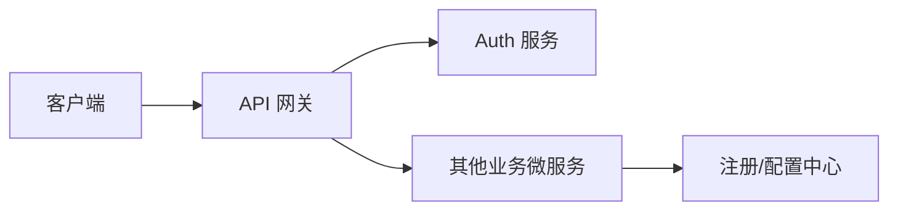
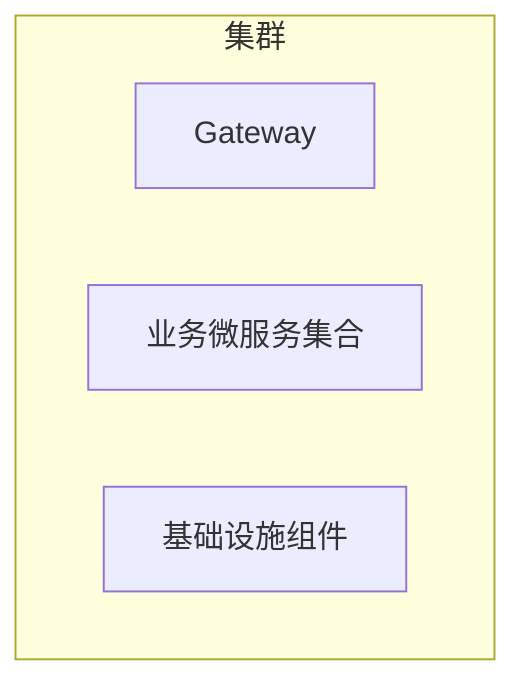

# 目标架构与组件选型

## 1. 总体架构概述

目标平台采用“根聚合工程 + 共享 parent-pom + 独立业务服务”的多模块 Maven 结构。当前仓库保留 `major_assignment` 作为过渡期单体，同时新增 `gateway`、`auth-service`、`user-service`、`common`、`*-service-api`、`legacy-adapter` 骨架，为阶段 2 的双路由迁移做准备。

当前结构约束如下：

- 根目录 `pom.xml` 只负责聚合，不承载业务依赖。
- `parent-pom` 统一锁定 Spring Boot / Spring Cloud / Micrometer Tracing / Resilience4j 版本。
- 业务服务只允许依赖 `common` 和其它服务的 `*-api` 模块，不允许直接依赖其它服务实现模块。
- `major_assignment` 暂时保留，直到 `legacy-adapter` 和网关双路由稳定后再逐步下线。

## 2. 架构总览图

## 3. 组件选型

### 3.1 服务注册与配置

| 项目 | 候选 | 选定 | 理由 | 备选切换条件 |
| --- | --- | --- | --- | --- |
| 注册中心 | Eureka / Nacos / Consul | Eureka Server | 与当前仓库已锁定的 Spring Cloud 2025.0.0 栈兼容，落地轻，便于先完成服务注册发现主链路 | 若后续切向 Kubernetes 原生服务发现，可评估 Spring Cloud Kubernetes |
| 配置管理 | `application.yml` + 环境变量 / Spring Cloud Config / Nacos Config / Apollo | Spring Cloud Config Server（native 配置仓库） | 统一管理 Gateway、业务服务、`agent-service` 与 `legacy-adapter` 的端口、数据源、注册发现和治理参数，减少本地配置漂移 | 若后续需要动态刷新、加密配置或多团队治理，可切换 Git 后端、Vault 或 Apollo |

### 3.2 API 网关

| 项目 | 候选 | 选定 | 理由 | 备选切换条件 |
| --- | --- | --- | --- | --- |
| API 网关 | Zuul / Spring Cloud Gateway | Spring Cloud Gateway | Spring 官方主推，支持 Reactor 模式、统一鉴权、限流、CORS、TraceId 注入 | 若必须统一接入 API 管理平台，可外接 APISIX / Kong 作为外层网关 |

### 3.3 服务间通信

| 项目 | 候选 | 选定 | 理由 | 备选切换条件 |
| --- | --- | --- | --- | --- |
| 同步 RPC | RestTemplate / WebClient / OpenFeign | OpenFeign + Spring Cloud LoadBalancer | 声明式接口、接口与 DTO 可沉淀进 `*-api` 模块，适合任务清单中的契约化拆分 | 若后续出现高吞吐、低延迟瓶颈，可对热点链路切换到 gRPC |
| 熔断与限流 | Hystrix / Resilience4j / Sentinel | Spring Cloud CircuitBreaker + Resilience4j | 与 Micrometer 集成好，纯 Java 依赖，适合作为统一 parent BOM 的基础能力 | 若团队后续全面切到阿里云治理栈，可换用 Sentinel |

### 3.4 核心接口、限流与熔断阈值

Gateway 统一按 `(clientIp, userId, routeId)` 分桶限流，默认单实例限流为 `replenish-rate=20`、`burst-capacity=40`、`requested-tokens=1`、`Retry-After=1s`。核心接口允许更高突发写入容量，但熔断错误率阈值更低，避免下游异常时继续放大写流量。

| 核心等级 | 接口 / 兼容语义 | 当前 Gateway routeId | HTTP 方法 | 目标服务 | 限流阈值（单实例） | 熔断器实例 | 熔断阈值 |
| --- | --- | --- | --- | --- | --- | --- | --- |
| 核心 | 考试提交：`/api/exams/{id}/submit`；当前切流路径为 `/api/student/exams/{id}/submit` | `student-exam-submit-route` | `POST` | `exam-service` | `replenish-rate=40`, `burst-capacity=80`, `requested-tokens=1`, `Retry-After=1s` | `exam-service-student-submit` | `failure-rate-threshold=30`, `minimum-number-of-calls=20`, `slow-call-duration-threshold=2s` |
| 常规 | 其他已切流业务接口 | 各业务 routeId | `GET/POST/PUT/DELETE` | 对应业务服务 | `replenish-rate=20`, `burst-capacity=40`, `requested-tokens=1`, `Retry-After=1s` | 默认与服务名或调用名一致 | `failure-rate-threshold=50`, `minimum-number-of-calls=10`, `slow-call-duration-threshold=2s` |
| 专项 | AI 生成接口 `/api/ai/**` | `ai-route` | `POST` | `ai-service` | `replenish-rate=2`, `burst-capacity=4`, `requested-tokens=1`, `Retry-After=3s` | `ai-service` | 继承默认熔断阈值 |
| 专项 | Agent 自然语言操作入口 `/api/agent/**` | `agent-route` | `GET/POST/PUT/DELETE` | `agent-service` | `replenish-rate=10`, `burst-capacity=20`, `requested-tokens=1`, `Retry-After=2s` | `agent-service` | 继承默认熔断阈值 |

配置来源：

- `config-server/src/main/resources/config-repo/gateway.yml` 的 `gateway.rate-limit.routes.student-exam-submit-route` 固化考试提交的宽松限流覆盖值。
- `config-server/src/main/resources/config-repo/gateway.yml` 的 `resilience4j.circuitbreaker.instances.exam-service-student-submit` 固化考试提交的严格熔断覆盖值。
- Gateway 与业务服务的运行时参数以配置中心为准，本文档中的核心接口清单需要同步更新。

### 3.5 消息与事件

| 项目 | 候选 | 选定 | 理由 | 备选切换条件 |
| --- | --- | --- | --- | --- |
| 事件总线 | Kafka / RabbitMQ / RocketMQ | RabbitMQ | 教学系统事件量中等，延迟和部署复杂度平衡较好，适合 outbox + 幂等消费 | 若后续需要更强的日志流式回放能力，可评估 Kafka |

### 3.6 可观测性栈

| 项目 | 候选 | 选定 | 理由 | 备选切换条件 |
| --- | --- | --- | --- | --- |
| 指标 | Prometheus / InfluxDB | Prometheus | Spring Actuator 原生支持，便于服务级指标采集与告警 | 若接入云监控平台，可做远程写扩展 |
| 仪表盘 | Grafana / Kibana Lens | Grafana | 与 Prometheus、Loki、Tempo 组合成熟 | 若日志平台统一为 ELK，可在可视化层补 Kibana |
| 日志 | ELK / Loki | Loki | 与 Grafana 同厂组合轻量，适合阶段 2 快速落地 | 若检索分析需求显著提升，可引入 Elasticsearch |
| 链路追踪 | Zipkin / Tempo / Jaeger | Tempo + Micrometer Tracing | 与 Grafana 打通顺滑，适合统一 TraceId 透传 | 若团队已有 Jaeger 运行经验，可替换为 Jaeger |

### 3.7 版本与 BOM 约束

| 组件 | 版本 | 约束说明 |
| --- | --- | --- |
| Java | 17 | 所有模块统一使用 Java 17 |
| Spring Boot | 3.5.3 | 与现有单体版本保持一致，降低阶段 2 迁移噪音 |
| Spring Cloud | 2025.0.0 | 由 `parent-pom` 统一 BOM 管控，子模块不得单独覆盖 |
| Micrometer Tracing | 1.3.x | 为 TraceId/MDC/OTLP 打底 |
| Resilience4j | 2.2.x | 统一熔断与限流能力 |
| Eureka Client / Server | BOM 管控（随 Spring Cloud 2025.0.0） | 由 Spring Cloud Netflix 依赖路径统一锁定，子模块不得单独覆盖 |

说明：本仓库当前采用 `parent-pom` 统一导入这些 BOM，并通过 Maven Enforcer 阻止子模块私自漂移版本。这样即便 `major_assignment` 仍处在单体阶段，新的微服务骨架也已经具备一致的升级入口。

## 4. 部署拓扑

## 5. 服务边界与领域划分

当前已落地的阶段 2 骨架边界如下：

- `gateway`：统一入口，后续承载路由、JWT 鉴权、限流、CORS、TraceId 注入。
- `auth-service`：登录、令牌、角色切换、认证上下文。
- `user-service`：用户档案、角色、教师/学生基础信息。
- `common`：公共响应、异常、MDC、Feign 与指标配置。
- `auth-service-api` / `user-service-api`：纯 Feign 接口与 DTO，不承载实现。
- `agent-service`：自然语言业务操作入口，拥有 Agent 会话、动作预览、确认状态和审计记录；不直接写课程、作业、考试、分析、通知、用户或 AI 业务表，执行时通过服务 API 调用数据拥有者。
- `legacy-adapter`：过渡期兼容层，承接旧单体向新网关的双路由迁移。

## 6. 非功能性约束

<!-- TODO: 性能、可用性、安全、合规等指标。 -->

## 变更记录

| 日期       | 变更人 | 变更内容 |
| ---------- | ------ | -------- |
| 2026-05-10 | 架构组 | 初版骨架 |
| 2026-05-12 | Codex | 注册发现切换为 Eureka，配置管理说明调整为本地配置过渡方案 |
| 2026-05-20 | Codex | 补充考试提交核心接口清单及 Gateway 限流、Resilience4j 熔断阈值差异 |
| 2026-06-12 | Codex | 补充 Agent 服务边界及 Gateway `agent-route` 限流说明 |
