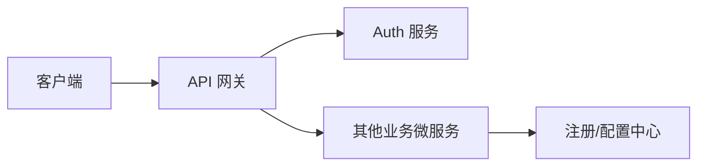
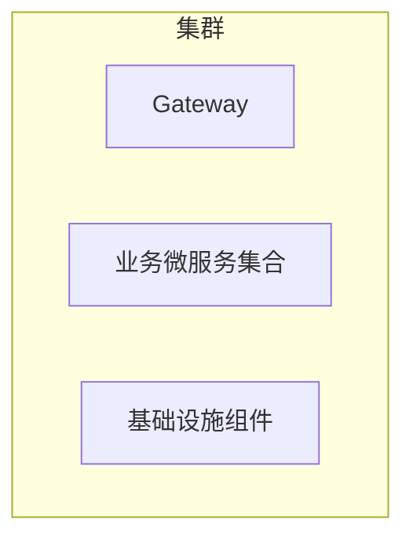

# 目标架构与组件选型

> 版本：v0.1
> 最后更新：2026-05-10
> 作者：架构组

## 1. 总体架构概述

<!-- TODO: 描述微服务化后的整体架构定位、设计原则与核心关注点。 -->

## 2. 架构总览图

## 3. 组件选型

### 3.1 服务注册与配置中心

<!-- TODO: 说明 Nacos 的选型理由、部署形态与命名空间规划。 -->

### 3.2 API 网关

<!-- TODO: 说明 Spring Cloud Gateway 的路由、限流、鉴权职责。 -->

### 3.3 服务间通信

<!-- TODO: Feign/OpenFeign、负载均衡、容错策略等选型。 -->

### 3.4 消息与事件

<!-- TODO: 事件驱动场景的消息中间件选型与使用规范。 -->

### 3.5 可观测性栈

<!-- TODO: 日志、指标、追踪三件套的组件与对接方式。 -->

## 4. 部署拓扑

## 5. 服务边界与领域划分

<!-- TODO: 列出拆分后的各微服务及其职责边界。 -->

## 6. 非功能性约束

<!-- TODO: 性能、可用性、安全、合规等指标。 -->

## 变更记录

| 日期       | 变更人 | 变更内容 |
| ---------- | ------ | -------- |
| 2026-05-10 | 架构组 | 初版骨架 |
